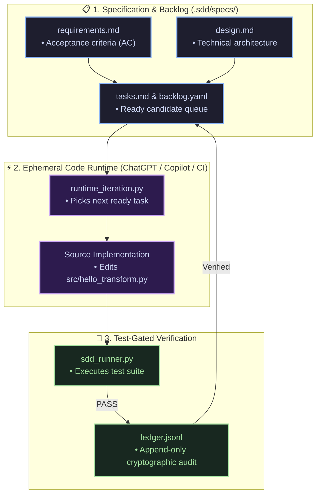
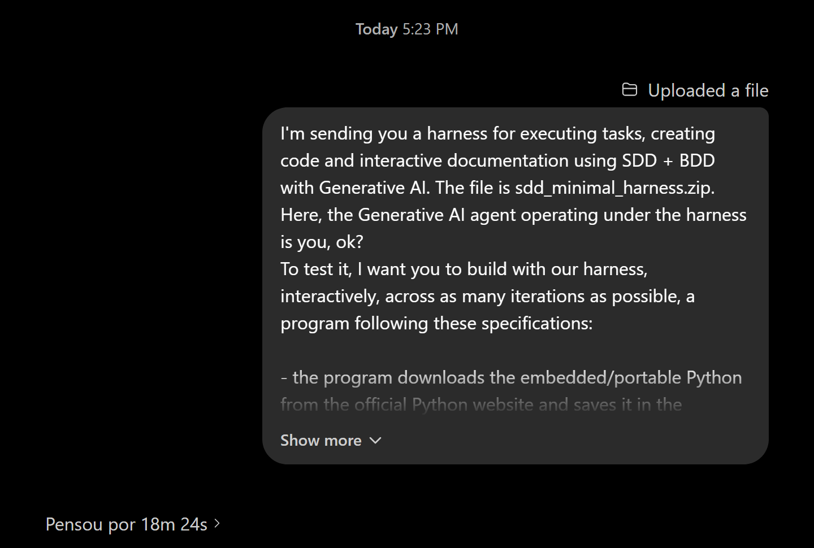
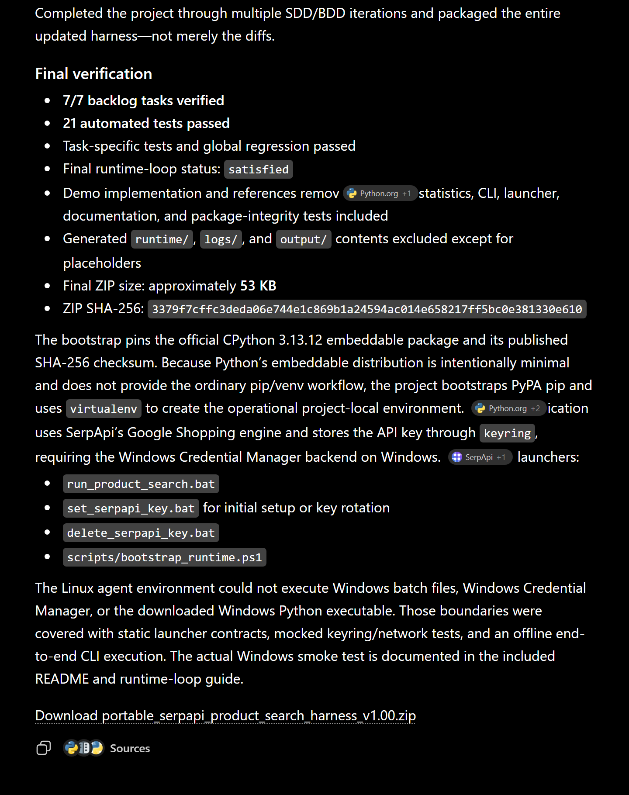
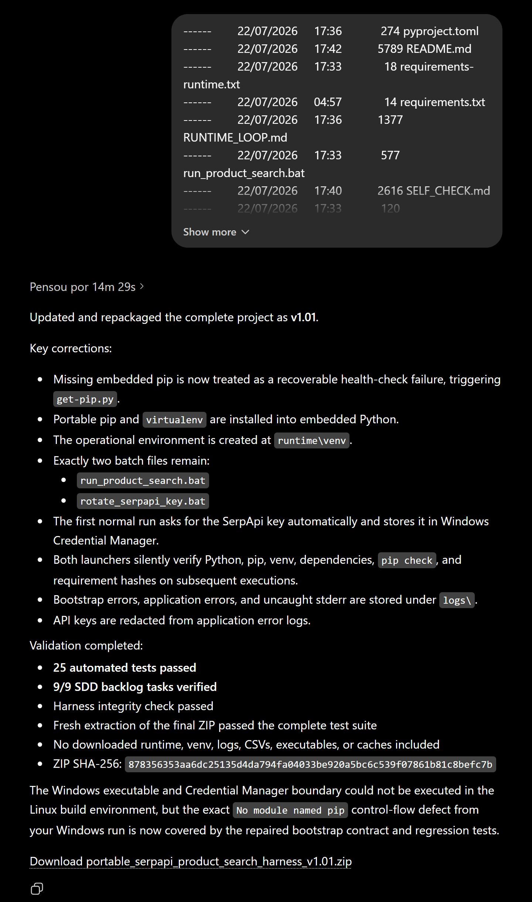
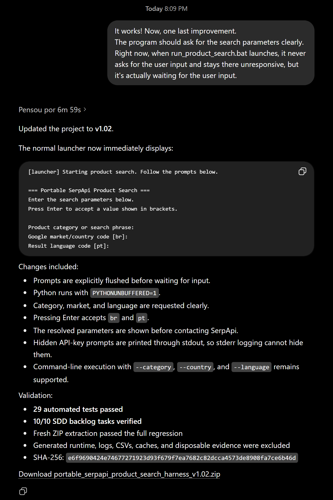
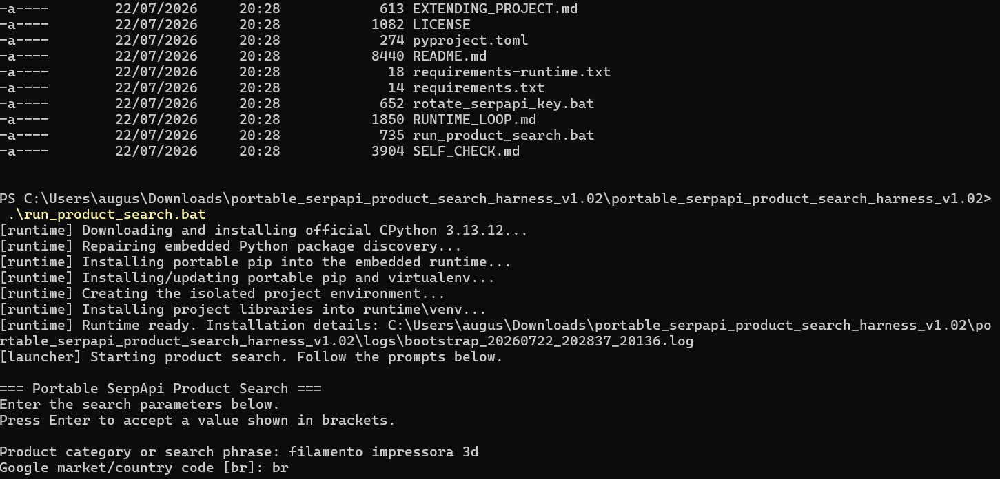
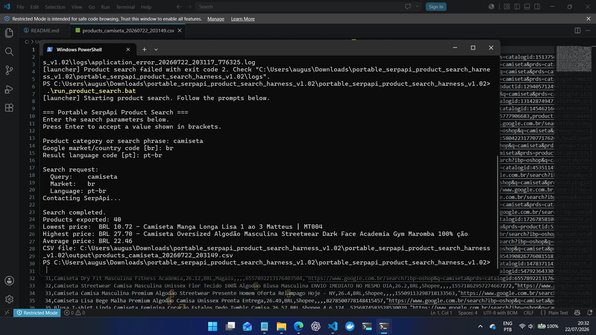

# Minimal SDD Harness

[](https://github.com/augusto-scarvalho/sdd_minimal_harness/actions/workflows/ci.yml)
[](https://www.python.org/)
[](LICENSE)

> Turn ChatGPT's ephemeral code runtime into a disciplined coding agent — an alternative to Claude Code, Codex, and other agentic CLIs, for the price of a chat subscription.

A lightweight harness for Spec-Driven Development (SDD) with agents, a dynamic backlog, an append-only ledger, and Python-based verification.

It is designed to run:

- locally;
- inside a container or pod;
- in an agent environment with read, edit, and terminal tools (for example, the temporary code runtime of ChatGPT or Microsoft 365 Copilot in agent/Think mode);
- in CI/CD;
- with any implementation language, as long as the verification commands are configured in YAML.

## An alternative to agentic CLIs

Agentic tools such as Claude Code and Codex give a model a persistent terminal on your machine. This harness offers a different trade: upload the harness as a zip to ChatGPT (or Microsoft 365 Copilot in agent/Think mode) and let the model operate it inside its own temporary code runtime. The harness supplies the rails — executable specs, a prioritized backlog, an append-only ledger, and test-gated task closure — so the chat session behaves like a disciplined coding agent instead of a one-shot code generator.



The whole loop happens inside a chat:

1. Upload the harness zip and state your specification in the conversation.
2. The model replaces the demo spec, derives backlog tasks, and iterates `prepare → edit → verify` until every task is `verified` by tests.
3. It returns a complete updated zip; you extract and run the program on your machine.
4. Paste real-world failures or new requests back into the chat — they become new verified backlog tasks in the next zip.

The trade-off is explicit: the runtime is remote, ephemeral, and 100% controlled by the provider. State persists only in the zips you exchange, sessions have time and network limits, and platform-specific behavior (for example, Windows batch files) cannot be executed there — only covered by contract tests, as the session below demonstrates. In exchange you get an auditable agentic loop with no API keys, no local installation, and no per-token billing.

## Real-world example: GPT 5.5 operating the harness

In [this shared conversation](https://chatgpt.com/share/6a615476-36e0-83e9-9203-76d8e137c344), GPT 5.5 received `sdd_minimal_harness.zip` in the ChatGPT web runtime and used the harness to build a portable SerpApi product-search tool for Windows across three interactive rounds, finishing every round with the backlog fully `verified` and the regression suite green.

**Round 1 — briefing.** The user uploads the harness and states the specification in chat:



**Round 1 — delivery (v1.00).** The agent replaces the demo spec and works through seven backlog tasks — including a deliberate failure-and-repair cycle where a mocked transport error leaked the API key and the next iteration added redaction — delivering with all harness gates green (7/7 verified, 21 tests, runtime loop `satisfied`):



**Round 2 — real-machine bug fix (v1.01).** The user pastes a bootstrap failure from their own Windows machine (`No module named pip` in the embeddable Python); the agent identifies the control-flow defect, repairs the bootstrap, and closes the feedback as two new verified tasks (9/9 verified, 25 tests):



**Round 3 — UX iteration (v1.02).** A final request — clear interactive prompts — becomes task ten, verified like everything else (10/10 verified, 29 tests):



### The delivered program running on Windows

First run on the user's machine: the launcher downloads the pinned CPython embeddable package, silently bootstraps pip and the isolated environment, and asks for the search parameters:



A completed search: 40 products exported to a price-sorted CSV in `./output`, with lowest, highest, and average prices printed on screen:



## Overview

```text
Spec + backlog + ledger
               ↓
Runner selects the highest-priority `ready` task
               ↓
Agent inspects, edits, and runs verifications
               ↓
Verifier runs task-specific tests and the global regression
               ↓
Task moves to `verified` or `blocked`
               ↓
Ledger and `tasks.md` are synchronized
               ↓
Cycle continues until the backlog is empty or a blocker is found
```

The runner does not implement code by itself. The session agent uses the runner and `tools/runtime_iteration.py` as auditable rails to work on one task at a time.

## Quick start

Requirements: Python 3.10+.

```bash
cd sdd_minimal_harness
pip install -r requirements.txt
python -m pytest -q
python tools/sdd_runner.py --spec hello-transform --status
python tools/runtime_iteration.py --spec hello-transform --prepare
```

## Core documentation

- `AGENTS.md`: mandatory instructions for the agent.
- `RUNTIME_LOOP.md`: running the native edit-and-verify cycle.
- `REPLACE_EXAMPLE.md`: files to delete, adapt, keep, and create when replacing `hello-transform` with your own program.
- `SELF_CHECK.md`: self-verification criteria for the current package.

## Structure

```text
.sdd/
├── runtime-loop.yaml
├── steering/
│   ├── agent-protocol.md
│   ├── critic-policy.md
│   ├── backlog-policy.md
│   └── spec-quality.md
└── specs/
    └── hello-transform/
        ├── requirements.md
        ├── design.md
        ├── tasks.md
        ├── backlog.yaml
        ├── backlog.seed.yaml
        ├── ledger.jsonl
        └── review.md
src/
└── hello_transform.py
tests/
├── test_hello_transform.py
├── test_sdd_runner.py
├── test_runtime_iteration.py
├── test_task_documentation_sync.py
└── test_replacement_documentation.py
docs/
└── screenshots/
tools/
├── sdd_runner.py
├── runtime_iteration.py
├── sdd_config.yaml
├── reset_demo.py
└── inject_audit_fault.py
.github/workflows/ci.yml
LICENSE
requirements.txt
```

## Main commands

### Show status

```bash
python tools/sdd_runner.py --spec hello-transform --status
```

### Validate the spec and backlog

```bash
python tools/sdd_runner.py --spec hello-transform --check
```

### Run one runner iteration

```bash
python tools/sdd_runner.py --spec hello-transform --once
```

### Run the runner until the backlog is empty

```bash
python tools/sdd_runner.py --spec hello-transform --loop
```

### Prepare or verify an agent iteration

```bash
python tools/runtime_iteration.py --spec hello-transform --prepare
python tools/runtime_iteration.py --spec hello-transform --verify --reason "Description of the change"
```

### Generate the next-task context

```bash
python tools/sdd_runner.py --spec hello-transform --next-prompt
```

## Adapting to another language

Edit `tools/sdd_config.yaml`:

```yaml
commands:
  verify:
    - "python -m pytest -q"
    # - "npm test"
    # - "go test ./..."
    # - "mvn test"
    # - "dotnet test"
    # - "make test"
```

The runner is language-agnostic and simply executes the declared commands.

## Possible states

```text
candidate
refine_required
ready
in_progress
implemented
critic_review
verified
blocked
rejected
stale
pruned
needs_human_decision
```

## Essential rules

- a `ready` task must have the minimum fields;
- every task must be linked to acceptance criteria;
- every task must declare consumers and evidence;
- references like `file.py::test_name` must exist;
- the configured commands must pass;
- each iteration records events in `ledger.jsonl`;
- a `verified` task must be checked `[x]` in `tasks.md`;
- the cycle stops when there are no open tasks or a blocker exists.

## Replacing the demo

The repository ships `hello-transform` as a completed example. To build your own program, do not delete the whole repository. Follow `REPLACE_EXAMPLE.md`, which contains the file tree, the deletion list, the files to adapt, and the minimum structure to create.
